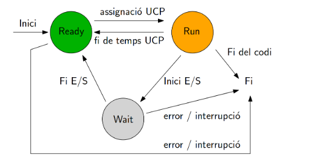

# Ètica en la Gestió de Processos
-Consideracions Ètiques: Discuteix els aspectes ètics relacionats amb la gestió de processos en el desenvolupament de software.
-Responsabilitat Professional: Destaca la importància de la responsabilitat i ètica professional en l'àmbit informàtic.
Transparència:

Assegurar que tots els membres de l'equip tinguin accés a la informació rellevant per a la presa de decisions i que es promogui la transparència en tots els nivells.
Integritat:

Fomentar la conducta honesta i íntegra en totes les activitats relacionades amb la gestió de processos, evitant comportaments fraudulents o enganyosos.
Responsabilitat Social:

Considerar les implicacions socials i ambientals dels processos gestionats, actuant de manera responsable i sostenible.
Privacitat i Protecció de Dades:

Garantir la protecció de la privacitat dels empleats, clients i altres parts interessades, complint les normatives de protecció de dades aplicables.
Diversitat i Inclusió:

Promoure una cultura que valore la diversitat i la inclusió, assegurant-se que totes les persones siguin tractades amb respecte i igualtat.
Justícia i Equitat:

Assegurar que els processos de gestió siguin justos i equitables, evitant discriminacions injustificades i promocionant la igualtat d'oportunitats.
Compliment de Normatives:

Conèixer i complir amb totes les normatives i lleis aplicables a la gestió de processos, evitant pràctiques il·legals o antiètiques.
Consultes ètiques:

Establir canals de consulta ètica on els membres de l'equip puguin plantejar dubtes o preocupacions relacionades amb la ètica en la gestió de processos.
Gestió Ètica de Projectes:

Integrar consideracions ètiques en la planificació i execució de projectes, assegurant que les decisions prengudes siguin èticament justificades.
Formació Ètica:

Proporcionar formació regular als membres de l'equip sobre qüestions ètiques i promoure una cultura organitzativa basada en valors ètics.
Lideratge Ètic:

Fomentar un lideratge basat en la integritat, exemplificant comportaments ètics i establint expectatives clares en aquest sentit.
Responsabilitat Professional:

Encoratjar els professionals de la gestió de processos a actuar de manera responsable i ètica en totes les seves interaccions i decisions.
Gestió de Conflictes d'Interessos:

Establir polítiques per identificar i gestionar els conflictes d'interessos, assegurant que les decisions siguin preses en benefici de l'organització i les parts interessades.
Comunicació Ètica:

Establir canals de comunicació per a la discussió oberta de qüestions ètiques, fomentant la col·laboració en la presa de decisions ètiques.
Avaluació Ètica de Resultats:

Incorporar una avaluació ètica en els resultats dels processos gestionats, mitjançant l'anàlisi de les repercussions ètiques de les decisions preses.

